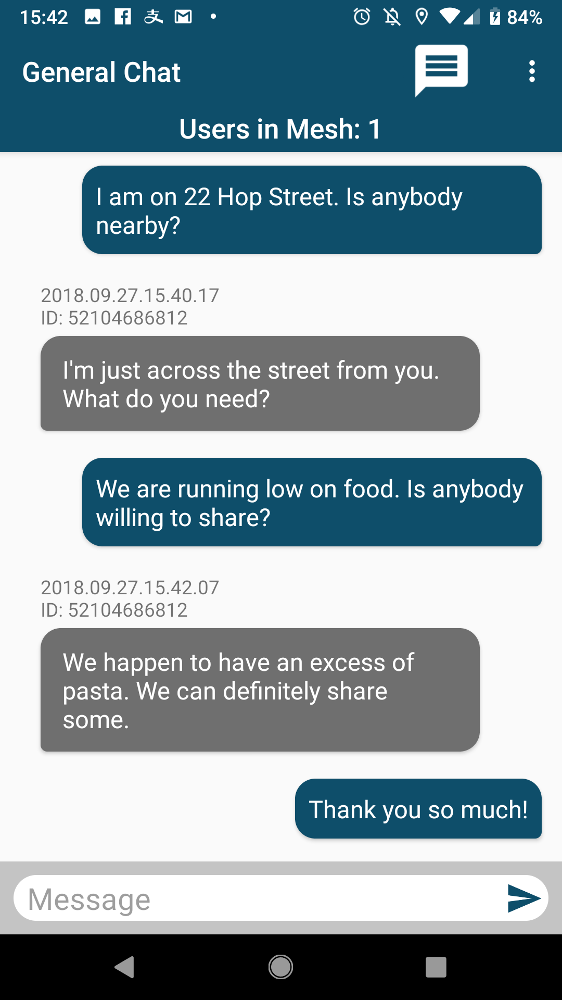
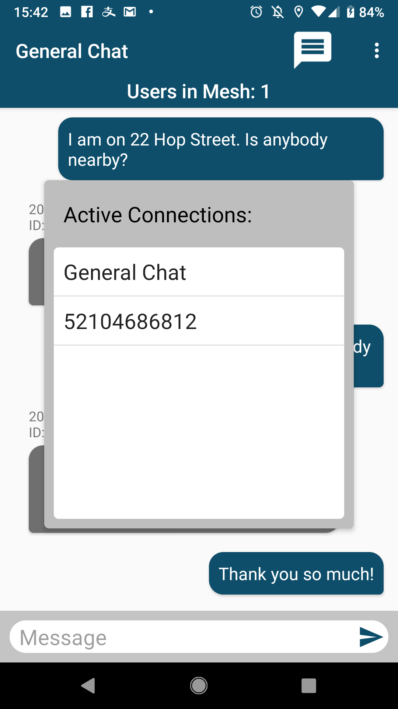

# FairMesh (Call For Code 2018)

Enabling communication without cellular or internet

This was a completely student-lead effort of co-ops at Fairventures lab

## Try It!

Sign up for the [beta on Google Play](https://play.google.com/apps/testing/com.fairmesh.mhao.meshnetwork).  
Access the [FairMesh Dashboard](https://fairmesh-dashboard.mybluemix.net/).

## Team Members

- Max Hao <mhao@fairventureslab.ca>
- Azfaar Qureshi <aqureshi@fairventureslab.ca>
- Shiqi Zhao <zhao.shiqi.art@gmail.com>
- Antra Labroo <alabroo@fairventureslab.ca>
- Meredith McKenzie <mmckenzie@fairventureslab.ca>

## Description

In 2012 hurricane Sandy hit New York and brought down all cellular towers. In Rockport, Texas, 95% of cell sites went down when hurricane Harvey hit in 2017. When natural disasters destroy critical infrastructure, disaster relief efforts that could be otherwise aided by stable and reliable means of communication are impaired. Based on past observations there has been much confusion as a result of cellular towers, landlines and other modes of communication going down. Most efforts to address these needs so far are focused on building stronger infrastructure, eg. sturdier towers and power lines. In this project we explore possible low cost communication alternatives built on top of existing hardware to ensure the scalability of the project all around the globe. 

In the critical hours just after a disaster occurs, aid workers also need to manage their resources and prioritize resource distribution to respond effectively and efficiently. Our application helps with this problem by providing a means for people to message each other via a dynamic, ad hoc mesh network and by interpreting these messages to help aid workers manage their resources.

Offline messaging provided by our solution mainly works via Bluetooth. The app will generate a unique ID for each user on launch, using the user’s phone number or their device ID if there’s no available phone number. The app then establishes connection via the Bluetooth Low Energy (LE) protocol with devices that are in range and running our app. When a user sends a message through our app, the message will be broadcasted to neighbouring nodes in our mesh network. Upon receiving a new message, a device would rebroadcast this message to all its neighbours, effectively acting as a relay to pass the message beyond radio range. Each device would keep a log of messages it has received to make sure messages are not relayed unnecessarily. These devices would then form a large scale mesh network connecting people even if they are not in direct radio range. 

The flooding technique would ensure every message is seen at least once by all devices on the mesh, each device would have a complete log of all devices ID’s on the mesh and thus private messaging is possible through having the app selectively display messages with matching destination ID. 

If some devices on the mesh have internet access, they would upload all their cached messages to the server. IBM Watson is used to parse the data and classify requests for routing and prioritization. This information would be visualized in a coordinator web portal, providing the aid organisations with insights into who needs help for what and where, facilitating more efficient disaster relief operations. 

## Privacy Policy

This app will require access to the user's phone data. The phone data will only be used to generate a unique user ID. If no phone data is provided, the app will instead generate an ID based off the device ID.

## Solution Roadmap

This project serves as a proof of concept for the viability of a bluetooth mesh communication structure in disaster situations. At the moment, FairMesh has only been implemented for Android devices that support Bluetooth LE, but, in theory, the concept could be extended to iOS based devices, embedded home devices, smart city structures (which is already in place in some cities), or on top of other networking protocols, like Wi-Fi direct or Zigbee. Ideally, the communication feature of our app could be integrated into more popular apps like Facebook Messenger, Facetime, etc. as an offline/disaster-mode feature to solve the problem of adoption. It could also be built as a cross-platform Progressive Web App (PWA), leveraging the browser’s device access capabilities, which would eliminate the need to support specific devices.

There are a few crucial features to be implemented to the App at the current stage. 
1. Message security and privacy: An algorithm to encode the messages to make sure it could only be decoded by devices with the correct destination ID. 
1. Periodic message cache clearing: Once a message log has been uploaded, the devices could start clearing old message caches for efficiency. 
1. Importing contact list: The app would ask for permission to access device contact book (or facebook / google contacts) for contact information, and display contacts’ names on receiving message. 

The server side and the front end website could be improved by. 
1. Integration to current aid organisation systems: To track dispatch and update the need information displayed and avoid repeated dispatch. 

Since the mesh network range is limited to a small radius by the Bluetooth LE hardware several ideas could overcome this.
1. In disaster prone areas passive relay devices could be distributed to strategic locations that allow the mesh network to maintain stability.  These devices could be battery powered and consume low amounts of energy so they last a long time.
1. In an area without pre-distributed devices, portable devices could be setup after the disaster strikes, allowing for the network to grow.

## Demo Video

## Screenshots

## Services

The following services are used,

- Message Analysis: [IBM Watson API](https://www.ibm.com/watson/developer/)
- Mesh Networking: [Underdark](http://underdark.io) 
- Mapping: [MapBox](https://www.mapbox.com/)

_Mesh networking by http://underdark.io_
